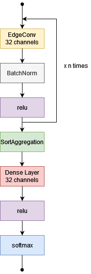

# MPNNNAP
### Message Passing Neural Network for Next Activity Prediction

## 📍 Overview
MPNNNAP is a an implementation of a *spatial-based* ConvGNN  using *Message Passing framework* to face the *Next Activity Prediction task* on BPI12 dataset.

This work adopts the pipeline presented in the paper ["Exploiting Instance Graphs and Graph Neural Networks for Next Activity Prediction"](https://link.springer.com/chapter/10.1007/978-3-030-98581-3_9) by Chiorrini et. al. and feed an MPNN with subgraphs obtained from instance graphs preprocessing.

Our network, called SimpleMPNN, is based on *graph-level classification* architecture for *ConvGNNs* described in ["A Comprehensive Survey on Graph Neural Networks"](https://arxiv.org/abs/1901.00596) and uses EdgeConv layers[[1]](https://arxiv.org/abs/1801.07829).


<div style="text-align:center"></div>

## 📂 Repository Structure

```sh
└── mpgnnap/
    ├── _data/
    │   ├── attributi.txt
    │   ├── test.g
    │   ├── training.g
    │   └── val.g
    ├── config/
    │   ├── config.json
    │   ├── config.py
    │   └── config_schema.json
    ├── data_info.py
    ├── dataset/
    │   └── dataset.py
    ├── grid.py
    ├── model/
    │   ├── metrics.py
    │   ├── mpgnnhandler.py
    │   ├── simplempgnn.py
    │   └── utils.py
    ├── plot.py
    ├── requirements.txt
    ├── test.py
    └── train.py

```
---

## 🚀 Getting Started

***Dependencies***

Please ensure you have Python 3.11 installed on your system.

### 🔧 Installation

1. Clone the mpgnnap repository:
```sh
git clone https://github.com/Vito-Scaraggi/mpgnnap
```

2. Change to the project directory:
```sh
cd mpgnnap
```

3. Install the dependencies:
```sh
pip install -r requirements.txt
```

### 🤖 Running

Before all set the configuration file *config/config.json* appropriately.
To start training execute:
```sh
python train.py
```
To start test execute:
```sh
python test.py
```
To plot training and test results execute:
```sh
python plot.py --path <path_to_experiment_folder>
```
To plot info about used dataset execute:
```sh
python data_info.py
```

## 👏 Contributors

[Christopher Buratti](https://github.com/christopherburatti), [Luca Guidi](https://github.com/LucaGuidi5), [Vito Scaraggi](https://github.com/Vito-Scaraggi)